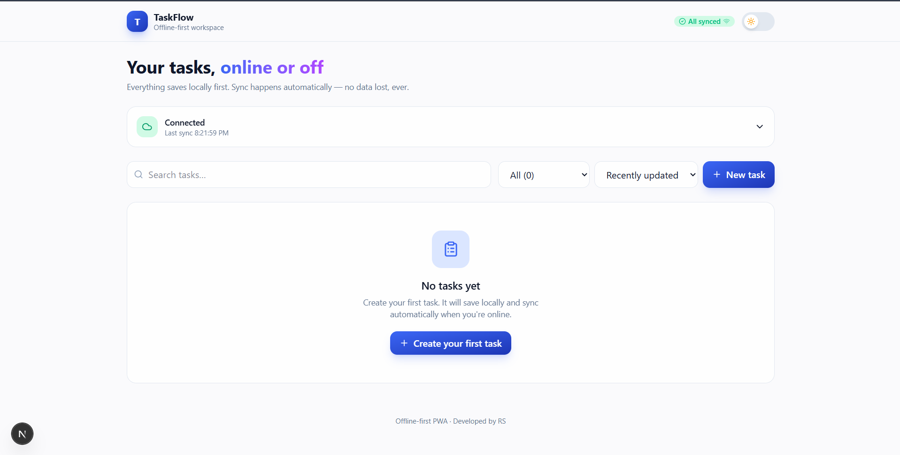
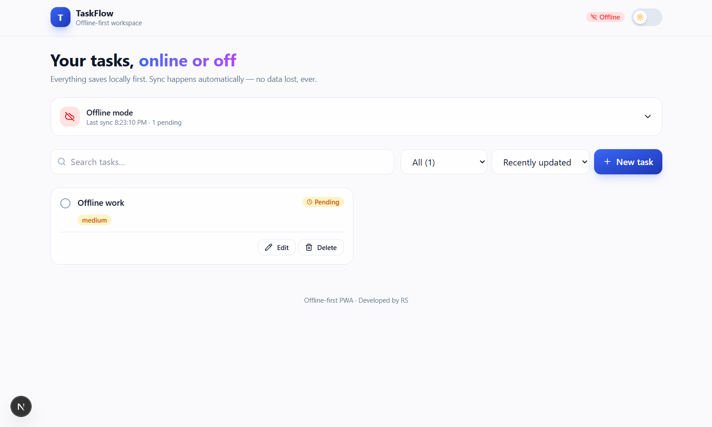
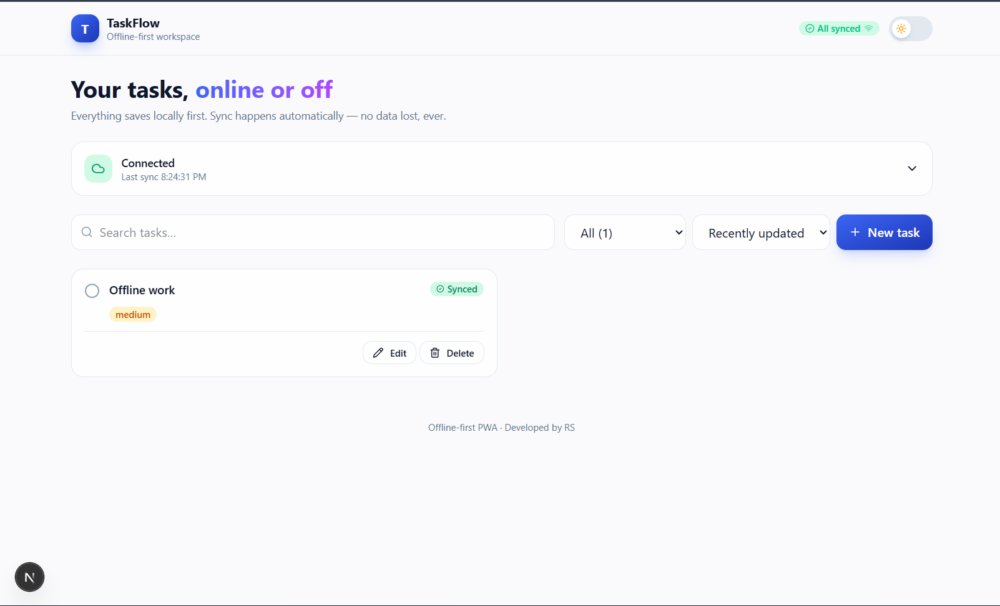

<div align="center">


# TaskFlow — Offline-First Workspace

**By Rohit Sawant (RS)**

A production-quality, offline-first task management PWA. Create, edit, and delete
tasks even when the network is down. Changes queue locally and sync automatically
when connectivity returns. Conflicts between devices are detected and resolved —
never silently overwritten.

[](https://nextjs.org)
[](https://react.dev)
[](https://www.typescriptlang.org)
[](https://tailwindcss.com)
[](https://dexie.org)
[](https://opensource.org/licenses/MIT)
[](http://makeapullrequest.com)

[Features](#-features) · [Screenshots](#-screenshots) · [Architecture](#-architecture) · [Setup](#-getting-started)

</div>

---

## 🎯 The Problem

Web applications become **unusable when connectivity is unstable**. A user on a
train, in a basement, or on a plane loses all ability to work. Modern web apps
assume the network is always available — but it isn't.

## 💡 The Solution

**TaskFlow** is a **true offline-first** application:

1. Every action writes to **local storage first** (IndexedDB)
2. The UI updates **instantly** — no network wait, ever
3. Changes are **queued** while offline with a visible pending state
4. When the network returns, queued changes **sync automatically**
5. **Conflicts** between devices are resolved via **CRDT merge logic** — never silently overwritten

The network becomes a **background detail**, not a blocker.

---

## ✨ Features

| Feature | Description |
|---|---|
| 🚀 **True offline-first** | Loads, works, and persists entirely without a network |
| 🔄 **Automatic sync** | Queued changes drain the moment connectivity returns |
| ⏳ **Honest pending states** | Tasks created offline show an amber "Pending" badge |
| 🔀 **CRDT conflict resolution** | Field-level last-write-wins with a conflict UI |
| 🌗 **Dark/light theme** | Smooth transitions + system-preference detection |
| 📱 **Installable PWA** | Works as a standalone app on desktop and mobile |
| 🎨 **Polished UI** | Tailwind v4, Framer Motion animations, accessible |
| 🔒 **Zero external APIs** | No OpenAI, no Stripe, no auth providers — nothing |

---

## 📸 Screenshots

<div align="center">

### 1. Online — All Synced


### 2. Offline Mode — Task Queued as Pending


### 3. Back Online — Auto-Synced


</div>

---

## 🏗 Architecture

```mermaid
flowchart TB
    subgraph Browser["Browser (Client)"]
        UI[UI Components<br/>React + Next.js]
        Engine[Sync Engine<br/>useSyncEngine]
        Dexie[(Dexie / IndexedDB<br/>tasks + syncLog)]
        CRDT[CRDT Merger<br/>field-level LWW]
        SW[Service Worker<br/>cache shell + assets]
    end

    subgraph Remote["Remote Store (Simulated)"]
        Remote[(localStorage<br/>fake server)]
    end

    UI --> Engine
    UI --> Dexie
    Engine --> Dexie
    Engine --> CRDT
    Engine -->|online| Remote
    Engine -.->|offline<br/>no-op| Dexie
    SW --> UI

    style Engine fill:#3b66f5,color:#fff
    style CRDT fill:#a855f7,color:#fff
    style Remote fill:#10b981,color:#fff